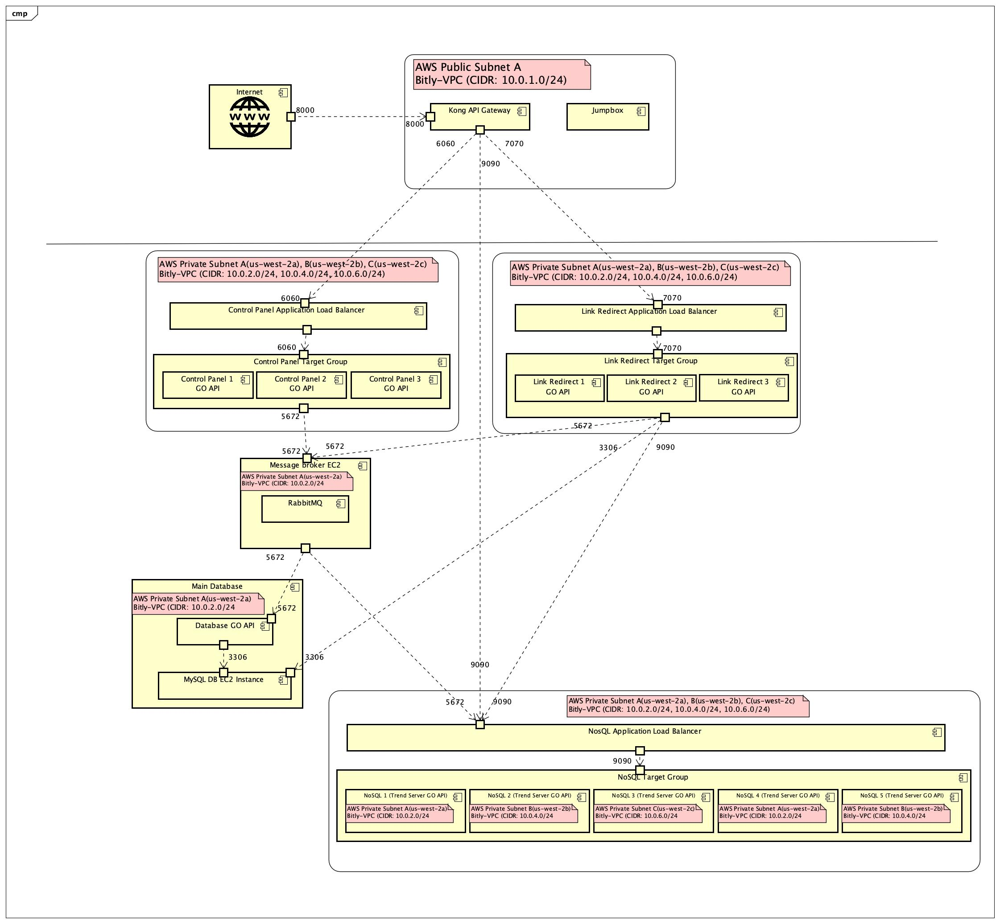
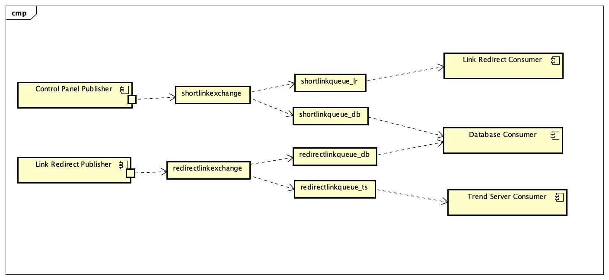

# Cloud Project - Bitly

- [Introduction](#Introduction)
- [Component Diagram](#ComponentDiagram)
- [Experimentation](#Experimentation)
- [Implementation](#Implementation)
- [Cloud Deployment](#CloudDeployment)
- [API Documentation](#APIDocumentation)
- [References](#References)

### Introduction

The requirements of the project were to design and create a URL-Shortener service such as Bitly. Steps followed:

- Learn Golang (Gorilla Mux, RabbitMQ, SQL, GoRoutines)
- Logic to generate short-url-code
- Get Familiar with CQRS and Event Sourcing
- Reading on Message Queues and which Queue to implement
- Design Message Broker system
- Design the Architecture
- Deploy on AWS and GCP

### Component Diagram

I created a Deployment Diagram using astahUML to get a general overview of how to connect the components with each other as well as design appropriate security groups for uninterrupted traffic-flow. The Component Diagram represents AWS Deployment. GCP was quite similar with some minute changes.

- Components
  - Control Panel Server : Used to create new shortlinks and publish on Message Exchange
  - Link Redirect Server : Used to redirect shortlinks to original url and publish on Message Exchange. Also, acts as consumer for shortlink exchange and create entry in cache server
  - Main Database (MySQL) : Used to store mapping for shorturl_code to long url and trend statistics
  - NoSQL Cluster : Acts as cache server for Link Redirect Server and as a Trend Server to display list of short links accessed.



### Experimentation

- Golang
  - I followed the gumball tutorial for design and implementation of golang code. I used `gorilla/mux` for HTTP Routes as well as `net/http` when I needed to perform simple request and a complete route was not required.
  - I tried to keep my design as modular and loosely coupled as possible. The servers (CP, LR, DB, NoSQL) have individual go files for different components such as HTTP Server, SQL Database and Message Queue System.

- Message Queue (RabbitMQ)
  - In the early phase, I explored AWS Message Queue (SQS). Message Queues would be highly efficient in the AWS Environment but I planned to deploy the application on GCP as well and it would require a lot of code refactoring.  
  - Next, I read about RabbitMQ and Apache Kafka. Apache Kafka is highly recommended and dependable, but it's comparatively more resource-consuming than RabbitMQ.
  - Finally, I decided to implement RabbitMQ as I won't be dealing with heavy workloads. Also, it would be cheaper compared to AWS SQS and will require very less code change to deploy on multiple environments.

- API Gateway (Kong)
  - I chose db-less Kong API Gateway, because it was easier and faster to implement.
  - Also, it helped to test my code locally instead of testing everything on the cloud environment.

- Database (MySQL)
  - As per the requirements, I implemented a simple MySQL Database to store short-url, long-url pairs and trends statistics for the short links.
  - `links` is used to store `longurl` against the generated `shorturl_code`
  - `trend_stats` is used to store the `access time` of short link against `shorturl_code`

- Networking (VPC and Security Groups)
  - I created a new VPC and security groups to keep the project separate from the regular environment.
  - Using lab quizzes experience, I kept only the Kong API Gateway in the Public Network and rest of the components/servers in the Private Network
  - I used a Jumpbox to test and connect to private instances
  - I created individual Security Groups for Kong API, Jumpbox, NoSQL cluster, RabbitMQ Broker Instance, Control Panel cluster, Link Redirect Cluster and MySQL Database.

- Scaling
  - Control Panel and Link Redirect Servers use an auto-scaling group and scale between 1-3 servers as per CPU Utilization. Enough load could not be simulated for Auto-Scaling group to startup 3 instances, so I kept `desired instances=3` for testing.

  - Node Discovery was a bit tricky as I was not using Apache Kafka and Zookeeper for Message Queues. So for NoSQL cluster, I used a target group with 5 fixed running instances in AP Mode instead of autoscaling group.

### Implementation

- Generating unique short url codes
  - I implemented a base62 encoding to generate unique short url codes. I used golang UnixNano time to get the base integer value to perform base62 encoding.

- Event Sourcing
  - Short Link Creation and Link Redirection are the events for the project.
  - When a new short link is created, the shorturl-longurl mapping needs to be stored in the database as well as link redirect cache server.
  - When a link is redirected, the statistics need to be updated in database and the trend server.
  - Link Redirect Server was a tricky part as it needs to be a publisher as well as a consumer of events.

- Message Broker System
  - I followed the example shared in Cloud Administation book. I used Control Panel server as the publisher for `shortlinkcreate` queue with Link Redirect server and MySQL Database as the consumers. I used Link Redirect server as the publisher for `redirectlink` queue with MySQL database and NoSQL cluster as the consumers.
  - As I had multiple consumers for each publisher, I used exchanges to publish the messages using a routing key and the consumers will declare their individual queues to consume the messages from the exchange using the routing-key.
  - This prevented the publisher to send a message to a particular hard-coded queue.

- Cache Update
  - NoSQL server uses a soft delete mechanism, hence, while fetching the documents on the NoSQL server using `/api`, all the documents soft deleted and created are returned. So to cause a cache-miss scenario, I wrote a background go function which runs every 5 mins since the link redirect startup and deletes all the keys that are not yet deleted.

- Unix Services
  - First, I tried to deploy the golang code for CP, LR, MySQL and Trend Server in Docker images. I used CentOS to create docker instance on AWS. Due to usage restrictions of CentOS, I could not create an auto-scaling group of Docker instances running golang code. So I decided to write simple Linux Services that would execute the golang binary file and I could start/enable that service just as mysql or docker.

- Environment Variables
  - To deploy CP, LR and TS in Kubernetes, I used Env Variables to pass mysql_server IP, rabbitmq configurations and nosql_server IP using yaml files.

### Cloud Deployment

- AWS
  - Create a new VPC Network with Subnets
  - Create a Jumpbox to test and connect to private instances
  - Create NoSQL AMI, Control Panel AMI with its service enabled and Link Redirect AMI with its service enabled
  - Create a RabbitMQ instance and a MySQL Database instance in Private Subnet
  - Deploy 5 EC2 instances with NoSQL AMI and register them with `:8888/node` api in Private Subnets
  - Attach NoSQL instances to a target group and application load balancer in Private Subnet and multiple Availability Zones
  - Deploy Control Panel server and Link Redirect servers using respective AMIs as auto-scaling groups with application load balancers in Private Subnet and multiple Availability Zones
  - Deploy Kong API Gateway as a standalone server in Public Subnet
  - Configure Kong API to connect to Control Panel with `/cp` path, Link Redirect with `/lr` path and Trend Server (NoSQL cluster) with `/ts` path
  - Also in AWS Kong API Gateway, I attached GCP Kong Gateway to create shortlinks and redirection in GCP.

- GCP (Extra Credit)
    > Due to Limited Resource Quota, I could create max 4 instances in a given region and zone. And GCP Load Balancer creates multiple instances using Instance Groups in the same region and zone. So, I had to implement NoSQL cluster with 4 nodes.

  - Create a new VPC Network with Subnets
  - Create a standalone Kong API server in Public Network
  - Create a MySQL DB Instance and add `skip-networking` in config
  - Create NoSQL Image, a template from the image and an instance group from the template
  - Deploy 4 VM instances with NoSQL Image using Instance Group and register them with `:8888/node` api in Private Network
  - Attach an application load balancer to the NoSQL Instance Group in Private Network
  - Create a Kubernetes Cluster
  - Deploy a RabbitMQ Cluster from Marketplace
  - Create a Jumpbox pod in Kubernetes to test private instances
  - Deploy Control Panel and Link Redirect Docker images in Kubernetes cluster
  - Create Load Balancer services to connect to Control Panel and Link Redirect deployments
  - Deploy Database and Trend Server as deployments only as they are not required to perform any explicit operations
  - Configure Kong API to connect to Control Panel Service with `/cp-gke` path, Link Redirect Service with `/lr-gke` path and Trend Server (NoSQL cluster) with `/ts-gke` path

### API Documentation

- Ping Check

  - Check if Control Panel Server is live  

    `curl gateway_ip:8000/cp/ping`

    ```json
    {
        "Test": "Control Panel API version 1.0 alive!"
    }
    ```

  - Check if Link Redirect Server is live  
  
    `curl gateway_ip:8000/lr/ping`

    ```json
    {
        "Test": "Link Redirect API version 1.0 alive!"
    }
    ```

  - Check if Trend Server Server is live  
  
    `curl gateway_ip:8000/ts`

    ```json
    {
        "status": "OK",
        "message": "Simple Java NoSQL Database",
        "version": "1.0"
    }
    ```

- Create Short Link from Control Panel Server

    Send a POST Request to CP endpoint with raw data as `{"url":"longurl"}`  
    Returns a JSON Response with short url and Status Code 200

    ```
    curl --location --request POST 'gateway_ip:8000/cp/createshortlink' \
           -H 'Content-Type: text/plain' \
           --data-raw '{"url":"https://golang.org/"}'
    ```

    ```json
    {
        "shorturl": "http://gateway_ip:8000/lr/8HiR3Bse",
        "longurl": "https://golang.org"
    }
    ```

- Redirect Link using Link Redirect Server  
  - Open `gateway_ip:8000/lr/3IZZqQmG` in browser to automatically redirect to long url  
    curl GET Request will return Response Code 302 to redirect URL  
    
    `curl --location --request GET gateway_ip:8000/lr/3IZZqQmG`  

    ```html
    <!doctype html>
    <html lang="en-us" class="a-no-js" data-19ax5a9jf="dingo">
    ....
    </html>
    Prints source of long url
    ```

- Get Link Statistics from Link Redirect Server  
    GET Request return a JSON Response with Status Code 200 and output as shown below  
    
    `curl gateway_ip:8000/lr/3IZZqQmG`

    ```json
    {
        "http://gateway_ip:8000/lr/3ArYszIU": {
            "All Time": "1",
            "Last 1 Day": "1",
            "Last 1 Hour": "0",
            "Last 1 Minute": "0"
        },
        "http://gateway_ip:8000/lr/3IZZqQmG": {
            "All Time": "2",
            "Last 1 Day": "2",
            "Last 1 Hour": "0",
            "Last 1 Minute": "0"
        },
    }
    ```

- Get latest visited links from Trend Server  
    GET Request returns a JSON Response with latest links visited

    `curl gateway_ip:8000/ts/api/listoflinks`

    ```json
    {
       "listoflinks": [
            {
                "shorturl_code": "3IZZqQmG",
                "accessed_at": " Tue Dec  8 2020 03:14:57 "
            },
            {
                "shorturl_code": "3rhGfdc7",
                "accessed_at": " Tue Dec  8 2020 07:10:38 "
            }
        ]
    }
    ```

### Future Improvements

- Frontend  
  A good UI front end can be developed for easy access to short url creation service and better visualization of trends for each short url

- User Management  
  Users can sign up for URL Shortener service and observe trends for links created by them. Also it can provide better User Authentication to avoid misuse of the service

- MySQL Database Cluster  
  Currently, MySQL DB is a standalone server. So each cloud environment has its own database and is unaware of each other. MySQL DB can be designed in a cluster for better availability and to create a multi-cloud model such that each cloud connects to the one and only MySQL DB Cluster.

- Auto Scaling NoSQL Cluster  
  NoSQL can be designed in auto-scale fashion with node discovery to register new nodes created by step up scaling policy and deregister existing nodes that are deleted by step down scaling policy.

### References

- [Martin Fowler Event Sourcing](https://martinfowler.com/eaaDev/EventSourcing.html)
- [Rabbit MQ Tutorial : Publish-Subscribe](https://www.rabbitmq.com/tutorials/tutorial-three-go.html)
- [Build a Rest API as GO Microservice](https://medium.com/storyteltech/a-mini-guide-build-a-rest-api-as-a-go-microservice-together-with-mysql-fc203a6411c0)
- [Designing a URL Shortener service](https://www.educative.io/courses/grokking-the-system-design-interview/m2ygV4E81AR)
- [When to use Apache Kafka and RabbitMQ](https://tanzu.vmware.com/content/blog/understanding-when-to-use-rabbitmq-or-apache-kafka)
- [Installing RabbitMQ on Amazon EC2](https://dev.to/ashutosh049/install-rabbitmq-on-amamzon-ec2-amazon-linux-2-3dpd)
